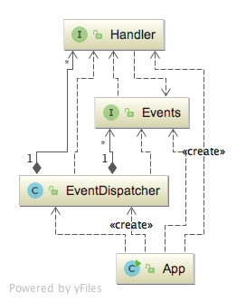

# Multiple Listeners For Each Event
Inspired from reactive architecture and nodejs, I developed a very
light library that you can dispatch handlers to events. What differentiates
this library from similar ideas are:
 
Now you can attach many listeners to any event. 
 
First we need to create an event:

EventDispatcher dispatcher = new EventDispatcher();   
        Events small=new SmallTask();   
        Events large=new LargeTask();   
        
then,we just need to attach a handler like this:

        dispatcher.registerChannel(small,new Handler(){
            @Override
            public void dispatch(Events content) {
                System.out.println("doing a small task 1!");
            }
        });
</code>
 
 
release 1: 

 
 
After successfull compilation: 
doing a small task 1!  
doing a small task 2!  
doing a small task 3!  
doing a large task 1!  
doing a large task 2!  

Next,...